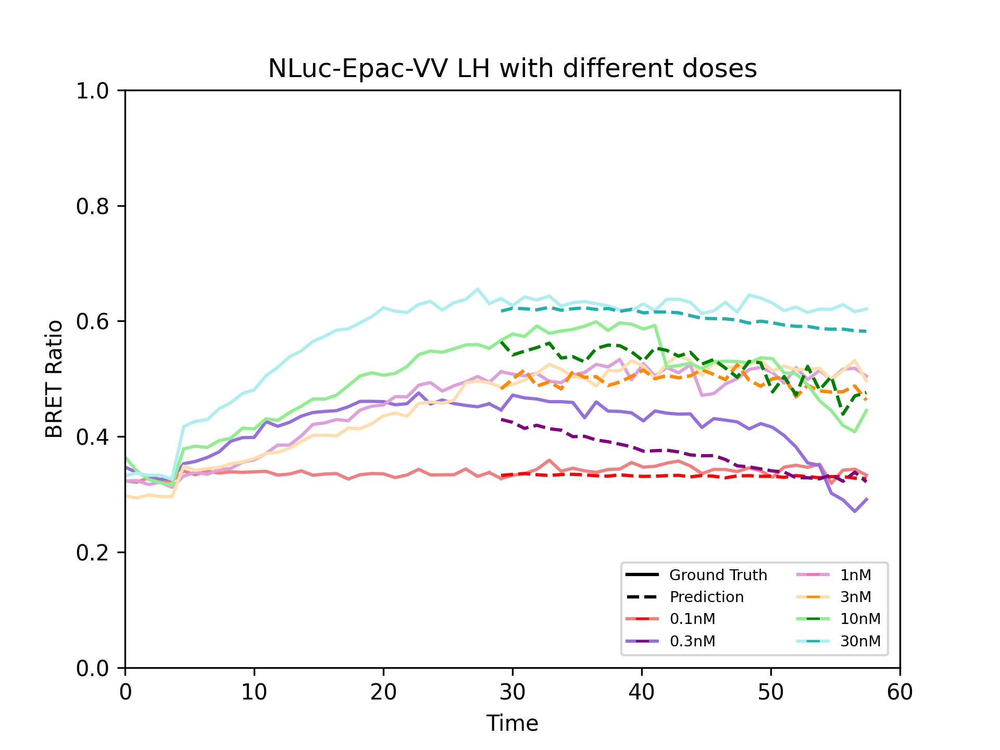
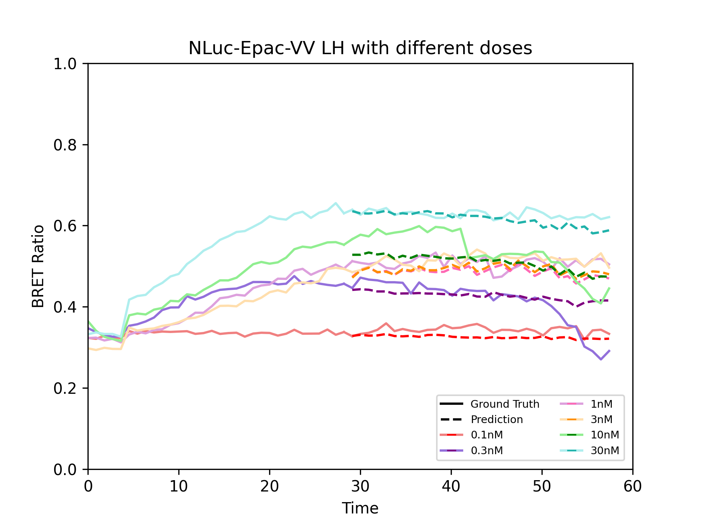
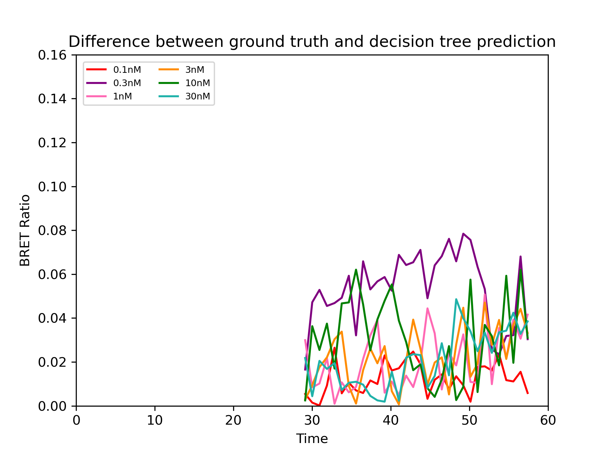
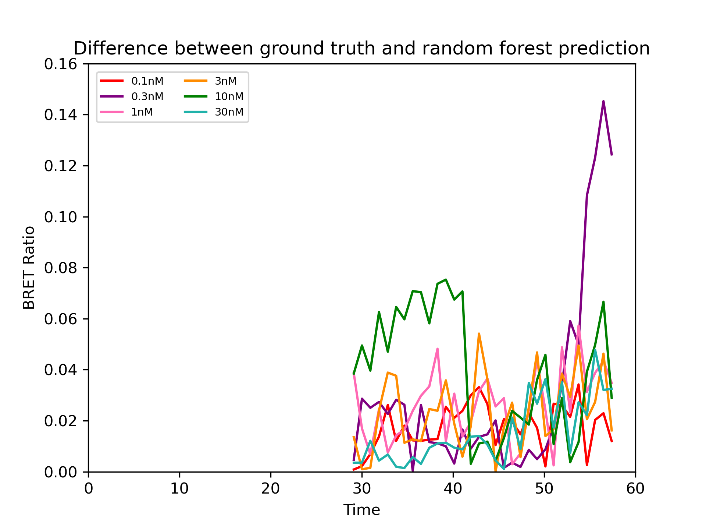

# Machine Learning Models to Predict the Behaviour of Dynamic Intracellular Signalling Processes

Paper sent to *CMSB 2024:  20th conference on Computational Intelligence methods for Bioinformatics and Biostatistics*

### Multi-step model prediction:

   

### Decision Tree prediction:

   

### Random Forest prediction:

   

### Decision tree difference:

   

### Random forest difference:

   
