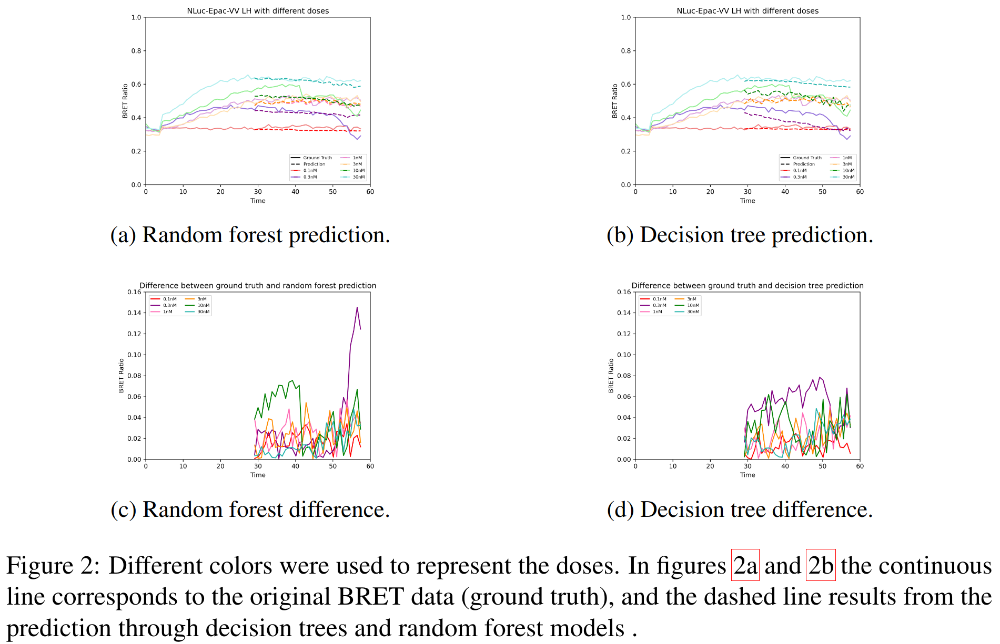

# Machine Learning Models to Predict the Behaviour of Dynamic Intracellular Signalling Processes

Paper sent to *CMSB 2024:  20th conference on Computational Intelligence methods for Bioinformatics and Biostatistics*

   
  

 
   

